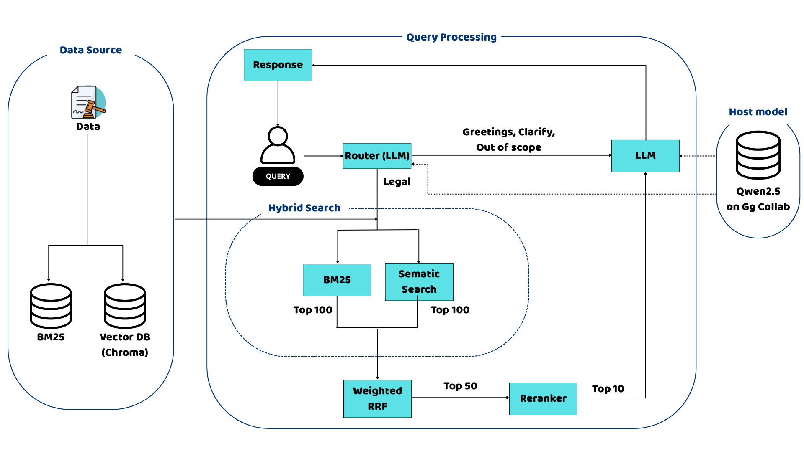

# 🏛️ ViLA-Vietnamese-Legal-Assistance

> A conversational AI system for Vietnamese legal question answering, Built on a Advanced RAG (Retrieval-Augmented Generation) with hybrid retrieval pipeline and fully self-hosted LLM(large language model)

---

## 📌 Overview

This project is a Vietnamese legal chatbot that goes beyond simple document retrieval. It combines **dense + sparse hybrid search**, **reciprocal rank fusion (RRF)**, **cross-encoder reranking** into a full conversational pipeline — all served locally without paid API calls.

**Key capabilities:**
- 🔍 Hybrid retrieval (ChromaDB + BM25) with RRF fusion
- 🗺️ Query routing (legal / greeting / out-of-scope / clarify)
- ⚡ LLM inference via vLLM (Qwen2.5 7B Instruct, 4-bit quantized)
- 💬 Interactive UI via Streamlit

---

## 🏗️ Architecture


## 📁 Project Structure

```
ViLA/
├── app.py                          # Streamlit entry point
├── requirement.txt                 # Dependencies
│
├── data/
│   ├── raw/                        # Raw legal documents
│   ├── chroma_db/                  # Persisted ChromaDB vector store
│   ├── BM25/                       # Serialized BM25 index (pickle)
│   └── processed                   # Raw legal documents with ID 
└── src/
    ├── config/
    │   └── config.py               # Central config (paths, hyperparameters)
    │
    ├── retrieval/
    │   ├── dense_retriever.py      # ChromaDB + HuggingFace embeddings
    │   ├── sparse_retriever.py     # BM25Retriever (deserialized from pickle)
    │   ├── rrf_fusion.py           # Pure RRF algorithm
    │   ├── hybrid_search.py        # Orchestrates dense + sparse + RRF
    │   └── langchain_retriever.py  # LangChain BaseRetriever wrapper
    │
    └── chain/
        ├── router.py               # QueryRouter (LLM-based classification)
        ├── prompts.py              # All prompt templates
        ├── memory.py               # Summarization-based conversation memory
        └── chain.py                # Full LCEL pipeline assembly
```

---

## ⚙️ Configuration

All hyperparameters are centralized in `src/config/config.py`:

| Parameter | Value | Description |
|---|---|---|
| `DENSE_TOP_K` | 100 | Top-k for ChromaDB retrieval |
| `SPARSE_TOP_K` | 100 | Top-k for BM25 retrieval |
| `RRF_K` | 100 | RRF smoothing constant |
| `RRF_WEIGHTS` | [0.4, 0.6] | BM25 : Chroma weight ratio |
| `HYBRID_TOP_K` | 50 | Top-k after RRF fusion |
| `RERANK_TOP_N` | 10 | Final docs after reranking |
| `MAX_HISTORY_TURNS` | 10 | Max conversation turns before summarization |
| `MAX_TOKEN_LIMIT` | 3000 | Token budget for context window |

---

## 📚 Knowledge Base & Legal Scope

To ensure the highest level of accuracy and legal compliance, the chatbot's knowledge base is grounded in a curated collection of official **Vietnamese Legal Documents**. The current version of **ViLA** covers the following key jurisdictions:

* **Civil Code 2015** (*Bộ luật Dân sự 2015*) – The foundational legal framework for civil relationships and rights.
* **Penal Code** (*Bộ luật Hình sự*) – Comprehensive regulations on crimes and punishments within the Vietnamese territory.
* **Labor Code 2019** (*Bộ luật Lao động 2019*) – Standards for labor relations, rights, and obligations of employees and employers.
* **Land Law 2024** (*Luật Đất đai 2024*) – The latest updated regulations regarding land ownership, management, and usage rights.

> **Data Engineering:** All raw legal texts were pre-processed, chunked and indexed into a **ChromaDB** vector store to enable efficient **Retrieval-Augmented Generation (RAG)**.

---


## 🛠️ Tech Stack

| Component | Technology |
|---|---|
| LLM | Qwen2.5 7B Instruct (4-bit) |
| LLM Serving | vLLM (OpenAI-compatible API) |
| Orchestration | LangChain (LCEL) |
| Vector Store | ChromaDB |
| Sparse Retrieval | BM25 (rank-bm25) |
| Embeddings | huyydangg/DEk21_hcmute_embedding (finetuned from "bkai-foundation-models/vietnamese-bi-encoder") |
| Reranker | huynhdat543/VietNamese_law_rerank (finetuned from "Alibaba-NLP/gte-multilingual-reranker-base" |
| UI | Streamlit |
| Compute | Google Colab T4 GPU |

---
 
## 🚀 Demo

| Link demo: https://www.youtube.com/watch?v=a8W2GahAcZw.
